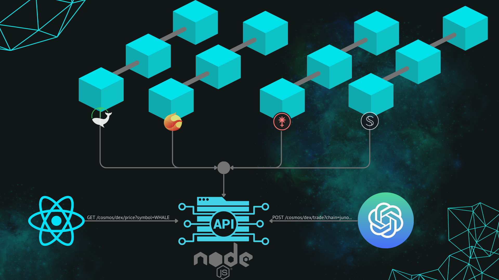

## User focused summary


We aimed to address a developer experience issue by creating a client-side infrastructure framework. Our framework enables developers to interact with Cosmos Multichain without needing in-depth knowledge of underlying blockchain mechanics. This is advantageous as it allows developers to work more efficiently, without being overwhelmed by the extensive information required to build applications on the Cosmoverse platform. This abstraction layer streamlines the development experience, allowing developers to work more efficiently and effectively.


 - Our product is built on top of the existing Hummingbot Gateway platform, which serves as a REST API server.

 - Our product is designed with security in mind. This product ensures the protection of communications through the use of HTTPS, which encrypts data transmitted between the user and the server. Additionally, sensitive information such as private keys is further secured by encrypting it with the user's password.
 
 - Our product boasts a highly scalable architecture that enables seamless integration and expansion of new connections.
  
 - Our product operates independently, eliminating the reliance on third-party data or services. Instead, we directly index and retrieve information from blockchains, ensuring a reliable and secure source of data.

## Investor pitch


We have identified a pressing problem in the industry and are confident that our solution meets an unmet need, positioning us at the forefront of this market. The existing complexity and steep learning curve act as significant barriers for developers, impeding the growth of the ecosystem as a whole. In response, we have developed a groundbreaking project that reduces this complexity and accelerates development for users.

Our journey began with the firsthand experience of solving the White Whale protocol challenge, which involved building a market-making bot. This firsthand experience highlighted the importance of simplifying the learning curve for end users, attracting more individuals to the ecosystem. To address this, we offer users a prebuilt, ready-to-use client-side server that can be easily deployed on their workstations. Additionally, for rapid prototyping, we will provide public servers for users to interact with.

Our product goes beyond limiting itself to a single exchange or market. Instead, our vision encompasses all chains and markets. We have developed custom backends that facilitate interaction with various chains and their applications, providing us with the ability to expand across multiple chains. While decentralized exchanges remain our primary focus, we are committed to encompassing the broad spectrum of DeFi functionality within a single, user-friendly framework. By striving to integrate most, if not all, DeFi features, we aim to simplify and democratize access to decentralized finance for a wider audience.

## Development Deepdive

During the development process, we encountered several challenges as we embarked on our journey with limited knowledge about the Cosmos ecosystem. To overcome this, we started by reverse engineering existing botting solutions, carefully studying their strengths and weaknesses. This deep analysis enabled us to build a more scalable and robust solution.

Our learning process involved a combination of UML diagrams, extensive documentation readings, and consultations with ChatGPT on various CosmWasm topics. It took us several weeks to gain a solid understanding of how to interact with the ecosystem, and we hadn't even delved into the Rust language at that point.

To enhance our knowledge, we studied and learned from the codebases of various projects, including the Gateway extension, Hummingbot, CosmJS, and the White Whale bot. This allowed us to grasp different perspectives and incorporate the best practices into our development process.

Throughout the development, we focused on improving our TypeScript skills and leveraged ChatGPT's assistance in code development. This enabled us to produce more readable, secure, and optimized code.

In order to ensure the reliability and functionality of our custom backend class that handles multichains, we built extensive test suites that cover a wide range of use cases. These tests serve as a solid foundation for maintaining the stability and performance of our product.

This is what we built
 - Rate limiter of Tendermint client. Public rpc are not reliable.
 - IBC token mapping. Translating IBC hashes to symbols are more detailed token information.
 - Multichain class that is capable to handle CosmWasm chains. 
 - In-memory transaction caching. Improving response time for repeated requests.
 - Wrapper around white whale core contracts. We used ts-codegen to generate interfaces and incorporate them in our libraries.
 - Validations, controllers, routes. 
 - Unit tests.

Our presentation goes into more detail about our experience with this project.


## Presentation
Video: https://vimeo.com/827020448

Slideshow:https://www.canva.com/design/DAFiCdFXKLc/aDM112fV_M6bO4alrP6COA/view?utm_content=DAFiCdFXKLc&utm_campaign=designshare&utm_medium=link&utm_source=publishsharelink


## DEMO
Video: https://vimeo.com/827016331


# Hummingbot Gateway

Hummingbot Gateway is a REST API that exposes connections to various blockchains (wallet, node & chain interaction) and decentralized exchanges (pricing, trading & liquidity provision). It is written in Typescript and takes advantage of existing blockchain and DEX SDKs. The advantage of using gateway is it provideds a programming language agnostic approach to interacting with blockchains and DEXs.

[Original Hummingbot Gateway Project](https://github.com/hummingbot/gateway)

Gateway may be used alongside the main [Hummingbot client](https://github.com/hummingbot/hummingbot) to enable trading on DEXs, or as a standalone module by external developers.

## Installation

### Run Gateway from source

Dependencies:
* NodeJS (16.0.0 or higher)
* Yarn: run `npm install -g yarn` after installing NodeJS

```bash
# Install dependencies
yarn

# Complile Typescript into JS
$ yarn build

# Create certificate folder in root directory
mkdir certs/

# Run Gateway setup script, which helps you set configs and CERTS_PATH.
# When promted for CERTS_PATH use created certs directory. Write simply certs
# When promted if we want to proceed, choose Yes.
# Ignore errors
$ chmod a+x gateway-setup.sh
$ ./gateway-setup.sh

# Create certs using Python util
python3 ssl_cert.py <PASSPHRASE>


# Start the Gateway server using PASSPHRASE
$ yarn start --passphrase=<PASSPHRASE>
```

## Postman workspace

Guide: https://docs.hummingbot.org/gateway/testing/#testing-with-postman

Workspace: https://www.postman.com/cryptassic/workspace/galaxygainz/overview

NOTE: Don't forget to add SSL certificates to postman. Certificate:  **ca_cert.pem**


### Run Gateway using Docker

Dependencies:
* [Docker](https://docker.com)

See the [`/docker`](./docker) folder for Docker installation scripts and instructions on how to use them.


### Build Gateway Docker Image locally

Dependencies:
* [Docker](https://docker.com)

To build the gateway docker image locally execute the below make command:

```bash
make docker
```

Pass the `${TAG}` environmental variable to add a tag to the docker
image. For example, the below command will create the `hummingbot/gateway:dev`
image.

```bash
TAG=dev make docker
```

## Documentation

See the [official Gateway docs](https://docs.hummingbot.org/gateway/).


#### Unit tests

Run an individual test folder or file, because all tests will be resource intensive.

```bash
npx jest cosmos.base.test.ts
```
